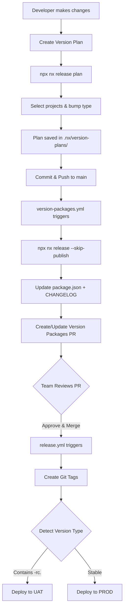

# SelfCare Monorepo PoC - Nx Release + Version Plans

This is a Proof of Concept (PoC) demonstrating a monorepo setup using **Nx** with **Version Plans** (similar to Changesets) for automated versioning and deployment.

## 🎯 PoC Objectives

- ✅ **Automated Versioning**: Test Nx Release with Version Plans
- ✅ **PR-Based Workflow**: Automatic PR creation/update for releases
- ✅ **Multi-Environment**: DEV/UAT/PROD deployment based on versions
- ✅ **Selective Deployment**: Only deploy affected projects
- ✅ **RC + Stable**: Support both pre-release (RC) and stable versions

## 📋 Table of Contents

- [Architecture Overview](#architecture-overview)
- [How Version Plans Work](#how-version-plans-work)
- [Workflow Automation](#workflow-automation)
- [Getting Started](#getting-started)
- [Testing Scenarios](#testing-scenarios)
- [Configuration Details](#configuration-details)
- [Commands Reference](#commands-reference)
- [Validation Checklist](#validation-checklist)

---

## 🏗️ Architecture Overview

### Repository Structure

```
selfcare-monorepo-poc/
├── apps/
│   ├── onboarding-ms/      # Microservice 1
│   ├── product-ms/          # Microservice 2
│   └── iam-ms/              # Microservice 3
├── infra/
│   └── resources/           # Infrastructure resources
│       ├── dev/              # DEV environment
│       │   ├── onboarding-ms/
│       │   ├── product-ms/
│       │   └── iam-ms/
│       ├── uat/              # UAT environment
│       │   ├── onboarding-ms/
│       │   ├── product-ms/
│       │   └── iam-ms/
│       └── prod/             # PROD environment
│           ├── onboarding-ms/
│           ├── product-ms/
│           └── iam-ms/
├── .nx/
│   └── version-plans/       # Version plan files (.md)
└── .github/
    └── workflows/
        ├── deploy-dev.yml           # Continuous DEV deployment
        ├── version-packages.yml     # PR automation
        └── release.yml              # Post-merge UAT/PROD deployment
```

### Key Concepts

- **Version Plans**: Markdown files in `.nx/version-plans/` that declare intended changes
- **Nx Release**: Command that reads version plans, bumps versions, generates CHANGELOGs, and commits
- **Automatic PR**: GitHub Action creates/updates "Version Packages" PR when version plans are pushed
- **Environment Detection**: RC versions (e.g., `1.1.0-rc.0`) → UAT, Stable versions (e.g., `1.1.0`) → PROD
- **Selective Deployment**: Only projects with version changes are deployed

---

## 🔄 How Version Plans Work

### Step-by-Step Flow



### Version Plan Creation

When a developer finishes work on a feature/fix:

```bash
# Interactive prompt to create version plan
npx nx release plan

# Example prompts:
# - Which projects to version? → onboarding-ms, product-ms
# - What bump type? → minor (1.0.0 → 1.1.0)
# - Message? → "Add user authentication flow"
```

This creates a file like `.nx/version-plans/auth-feature-20241215.md`:

```markdown
---
onboarding-ms: minor
product-ms: minor
---

Add user authentication flow with JWT tokens and refresh mechanism
```

### Automated Processing

1. **Developer pushes** version plan to `main`
2. **GitHub Action detects** `.nx/version-plans/**` changes
3. **Nx Release runs**: `npx nx release --skip-publish`
   - Reads all `.md` files in `.nx/version-plans/`
   - Calculates new versions for each project
   - Updates `package.json` and `CHANGELOG.md`
   - Deletes processed version plan files
   - Creates a git commit
4. **GitHub Action creates/updates PR** titled "chore: Release (Version Packages) 🦋"
5. **Team reviews** the aggregated changes
6. **On merge**, tags are created and deployment workflows trigger

---

## 🤖 Workflow Automation

### 1. `deploy-dev.yml` - Continuous DEV Deployment

**Trigger**: Every push to `main` (except version plans and CHANGELOGs)

**Purpose**: Continuous deployment to DEV environment

**Logic**:
- Detects affected projects via file changes
- Deploys only changed microservices/infrastructure
- Runs independently from release workflow

**Example**:
```
Push: apps/onboarding-ms/src/controller.ts
→ Deploys onboarding-ms to DEV (not product-ms or iam-ms)
```

---

### 2. `version-packages.yml` - PR Automation

**Trigger**: Push to `main` with changes in `.nx/version-plans/**`

**Purpose**: Automatically create/update "Version Packages" PR

**Logic**:
1. Check if version plan files exist
2. Run `npx nx release --skip-publish` to:
   - Bump versions in `package.json`
   - Generate/update `CHANGELOG.md`
   - Delete processed `.md` files
   - Create commit with changes
3. Check if "Version Packages" PR exists
4. Create new PR or update existing one
5. Add summary of changes to PR body

**PR Body Example**:
```markdown
## 📦 Version Changes

This PR was automatically generated by the Version Packages workflow.

### Changed Projects:
- **onboarding-ms**: 1.0.0 → 1.1.0
- **product-ms**: 1.0.0 → 1.0.1

### Changesets Applied:
- Add authentication flow (`auth-feature-20241215.md`)
- Fix database connection pool (`bugfix-db-20241215.md`)

Once merged, tags will be created and deployment workflows will trigger.
```

---

### 3. `release.yml` - Post-Merge Deployment

**Trigger**: Push to `main` with changes in `**/package.json` or `**/CHANGELOG.md`

**Purpose**: Create tags and deploy to UAT or PROD

**Logic**:
1. **Detect Release Commit**: Check if commit message matches release pattern
2. **Extract Changed Projects**: Parse `package.json` files with version changes
3. **Create Git Tags**: Tag each project (e.g., `onboarding-ms-v1.1.0`)
4. **Determine Environment**:
   - If version contains `-rc.` → Deploy to **UAT**
   - Otherwise → Deploy to **PROD**
5. **Create GitHub Release**: With changelog and prerelease flag for RC

**Environment Detection Examples**:
```bash
# RC version → UAT
"version": "1.1.0-rc.0"  → Deploys to UAT

# Stable version → PROD
"version": "1.1.0"       → Deploys to PROD
```

---

## 🚀 Getting Started

### Prerequisites

- Node.js (v18+)
- npm or pnpm
- Git

### Installation

```bash
# Install dependencies
npm install

# Verify Nx is available
npx nx --version
```

### Your First Version Plan

```bash
# 1. Make some changes to a microservice
echo "// New feature" >> apps/onboarding-ms/src/index.ts

# 2. Create a version plan
npx nx release plan

# Follow prompts:
# - Select: onboarding-ms
# - Bump: minor
# - Message: "Add new authentication feature"

# 3. Check generated file
ls .nx/version-plans/
# → new-feature-<timestamp>.md

# 4. Commit and push
git add .
git commit -m "feat: add authentication to onboarding-ms"
git push origin main

# 5. Watch GitHub Actions create the PR
# → Go to GitHub and see "chore: Release (Version Packages) 🦋" PR
```

---

## 🧪 Testing Scenarios

### Scenario 1: Simple Stable Release

**Goal**: Test single project minor bump to PROD

```bash
# 1. Create version plan
npx nx release plan
# Select: onboarding-ms
# Bump: minor
# Message: "Add health check endpoint"

# 2. Push and trigger PR creation
git add .
git commit -m "feat: add health check"
git push origin main

# 3. Review PR
# → Check package.json shows 1.0.0 → 1.1.0
# → Check CHANGELOG.md updated
# → Check version plan deleted

# 4. Merge PR
# → release.yml creates tag: onboarding-ms-v1.1.0
# → Deploys to PROD (no -rc in version)
```

**Expected Results**:
- ✅ Version Packages PR created automatically
- ✅ `onboarding-ms/package.json`: `1.0.0` → `1.1.0`
- ✅ `onboarding-ms/CHANGELOG.md` updated
- ✅ Git tag `onboarding-ms-v1.1.0` created
- ✅ Deployed to PROD environment

---

### Scenario 2: RC Release for UAT

**Goal**: Test pre-release version for UAT testing

```bash
# 1. Create version plan with preminor
npx nx release plan
# Select: product-ms
# Bump: preminor
# Message: "Test new payment integration"

# 2. Push changes
git add .
git commit -m "feat: add payment integration (RC)"
git push origin main

# 3. Merge generated PR
# → Version becomes 1.1.0-rc.0
# → release.yml detects -rc.0
# → Deploys to UAT (not PROD)

# 4. After UAT approval, create stable release
npx nx release plan
# Select: product-ms
# Bump: patch (to remove -rc and stabilize)
# Message: "Stabilize payment integration"

# Push → Merge PR → Deploys to PROD as 1.1.0
```

**Expected Results**:
- ✅ First merge: `product-ms` → `1.1.0-rc.0` → UAT
- ✅ Second merge: `product-ms` → `1.1.0` → PROD
- ✅ GitHub Release marked as pre-release for RC

---

### Scenario 3: Multiple Projects in Single Plan

**Goal**: Version multiple projects together

```bash
# 1. Make changes to multiple microservices
echo "// Shared update" >> apps/onboarding-ms/src/index.ts
echo "// Shared update" >> apps/iam-ms/src/index.ts

# 2. Create single version plan for both
npx nx release plan
# Select: onboarding-ms, iam-ms
# Bump: patch
# Message: "Update shared authentication library"

# 3. Push and merge
git add .
git commit -m "fix: update auth library across services"
git push origin main

# → Single PR updates both projects
# → Both get v1.0.1
# → Both deployed together
```

**Expected Results**:
- ✅ Single PR updates multiple `package.json` files
- ✅ Both projects get same version bump
- ✅ Combined CHANGELOG entry
- ✅ Two tags created: `onboarding-ms-v1.0.1`, `iam-ms-v1.0.1`

---

### Scenario 4: Accumulating Changes

**Goal**: Multiple version plans before release

```bash
# Developer A
npx nx release plan
# Select: onboarding-ms, Bump: minor, Message: "Add feature A"
git add .
git commit -m "feat: feature A"
git push origin main

# Developer B (before PR merged)
npx nx release plan
# Select: onboarding-ms, Bump: patch, Message: "Fix bug B"
git add .
git commit -m "fix: bug B"
git push origin main

# → Version Packages PR automatically updates
# → Shows both changes
# → Final version: 1.1.0 (minor > patch)
# → CHANGELOG includes both messages
```

**Expected Results**:
- ✅ PR updates with each push
- ✅ Version bump follows highest bump type
- ✅ All changes listed in CHANGELOG
- ✅ All version plan files deleted on merge

---

## ⚙️ Configuration Details

### `nx.json` - Nx Release Configuration

```json
{
  "release": {
    "versionPlans": true,
    "projects": [
      "apps/*",
      "infra/resources/dev/*",
      "infra/resources/uat/*",
      "infra/resources/prod/*"
    ],
    "changelog": {
      "projectChangelogs": {
        "createRelease": false,
        "file": "{projectRoot}/CHANGELOG.md"
      }
    },
    "git": {
      "commit": true,
      "tag": false,
      "stageChanges": true
    }
  }
}
```

**Key Settings**:
- `versionPlans: true`: Enable version plans feature
- `projects`: Which directories to scan for versionable projects
- `git.tag: false`: Workflows handle tagging (avoids PR branch pollution)
- `git.commit: true`: Nx commits version changes automatically

### Maven Support (Future)

For Java projects with `pom.xml`:

```bash
npm install -D @nx/maven

# Nx automatically detects pom.xml files
# Updates <version> tags alongside package.json
```

---

## 📝 Commands Reference

### Version Plan Management

```bash
# Create version plan (interactive)
npx nx release plan

# Preview what release would do (dry-run)
npx nx release --dry-run

# Actually perform release (used by GitHub Actions)
npx nx release --skip-publish
```

### Nx Workspace Commands

```bash
# Show dependency graph
npx nx graph

# Run build for affected projects
npx nx affected -t build

# See what's affected by current changes
npx nx show projects --affected
```

### Git Operations

```bash
# View version plan files
ls -la .nx/version-plans/

# Check current versions
cat apps/*/package.json | grep '"version"'

# View tags
git tag -l
```

---

## ✅ Validation Checklist

Use this checklist to verify the PoC works correctly:

### Initial Setup
- [ ] Dependencies installed (`npm install`)
- [ ] Nx CLI available (`npx nx --version`)
- [ ] Version plans directory exists (`.nx/version-plans/`)

### Version Plan Creation
- [ ] `npx nx release plan` runs without errors
- [ ] Version plan file created in `.nx/version-plans/`
- [ ] File contains correct project and bump type

### PR Automation
- [ ] Push triggers `version-packages.yml` workflow
- [ ] Workflow completes successfully
- [ ] "Version Packages" PR created/updated
- [ ] PR body shows correct version changes
- [ ] `package.json` files updated correctly
- [ ] `CHANGELOG.md` files updated
- [ ] Version plan files deleted

### Release & Deployment
- [ ] Merge triggers `release.yml` workflow
- [ ] Git tags created with correct naming
- [ ] RC versions deploy to UAT
- [ ] Stable versions deploy to PROD
- [ ] GitHub Release created

### Continuous DEV
- [ ] Code changes trigger `deploy-dev.yml`
- [ ] Only affected projects detected
- [ ] DEV deployment runs successfully

---

## 🎓 Key Learnings

### Why Version Plans?

- **Identical to Changesets**: Same developer experience, native to Nx
- **No Extra Tools**: No Changesets bot or external services
- **Single Command**: `nx release` handles everything (version + changelog + commit)
- **Git-Based**: Version plans are files in the repo, trackable in PRs

### Why 3 Workflows?

1. **deploy-dev.yml**: Continuous deployment (every change)
2. **version-packages.yml**: PR automation (when version plans pushed)
3. **release.yml**: Tag creation + UAT/PROD deploy (when PR merged)

This separation keeps concerns distinct and workflows simple.

### Why `git.tag: false`?

If Nx creates tags during `nx release` in the PR workflow:
- Tags get created on a branch (not main)
- Creates confusion and clutters tag list
- Solution: Workflows create tags after merge on main

---

## 🔗 Resources

- [Nx Release Documentation](https://nx.dev/features/manage-releases)
- [Version Plans Guide](https://nx.dev/features/manage-releases#version-plans)
- [Nx Maven Plugin](https://nx.dev/nx-api/maven)
- [GitHub Actions Workflow Syntax](https://docs.github.com/en/actions/reference/workflow-syntax-for-github-actions)

---

## 📄 License

This is a PoC for internal evaluation. See main SelfCare repositories for license information.
